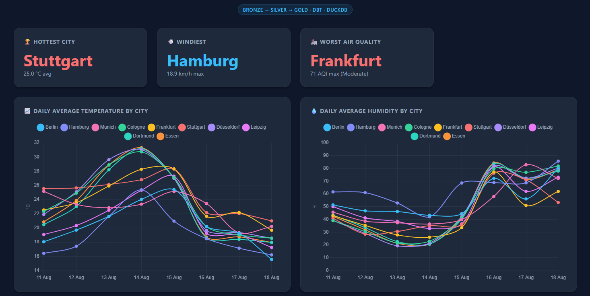
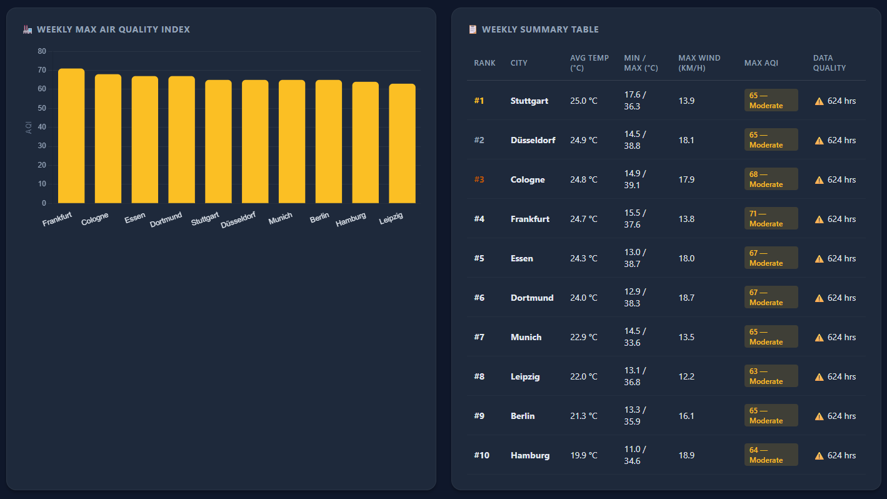

# Weather Insights Pipeline

A data pipeline that fetches hourly weather and air quality data for 10 German cities from the Open‑Meteo API, validates it with Pydantic, transforms it through a Bronze → Silver → Gold medallion architecture with dbt + DuckDB, and generates an interactive HTML dashboard.

## Architecture

```
Open-Meteo API (Weather + Air Quality)
        │
        ▼
   Bronze  (raw JSON, Pydantic-validated, one deterministic file per city per fetch window)
        │
        ▼
   Silver  (cleaned, typed hourly time series)
        │
        ▼
   Gold    (daily + weekly aggregates: temperature, humidity, wind, air quality)
        │
        ▼
   HTML Dashboard (Chart.js, self-contained)
```

## Tech Stack

| Layer | Tool |
|---|---|
| Extraction | Python (`requests`) |
| Validation | Pydantic — schema + array-length consistency checks on every API response before persistence |
| Resilience | Custom rate limiter, full-jitter exponential backoff, circuit breaker (closed/open/half-open state machine) |
| Storage & Query | DuckDB |
| Transformation | dbt |
| Dashboard | Self-contained HTML + Chart.js |
| Orchestration | Currently run manually (`python main.py`) |

## Data Sources

- **API:** Open-Meteo (free, no key required)
- **Endpoints:** Forecast (`/v1/forecast`) — temperature, humidity, wind, weather code; Air Quality (`/v1/air-quality`) — European AQI, US AQI, PM10, PM2.5
- **Cities:** 10 German cities (Berlin, Hamburg, Munich, Cologne, Frankfurt, Stuttgart, Düsseldorf, Dortmund, Essen, Leipzig)
- **Window:** rolling 7-day forecast, refetched and overwritten on each run

## Pipeline Layers

| Layer | Description |
|---|---|
| **Bronze** | Raw JSON per city, validated against a Pydantic schema (`OpenMeteoWeatherResponse` / `OpenMeteoAirQualityResponse`) before being saved. Filenames are deterministic (`{city_id}_{start_date}_{end_date}.json`) and overwritten on each run, keyed to the fetch window — reruns are idempotent by design. |
| **Silver** | Cleaned, typed hourly time series keyed by `city_id` |
| **Gold** | `fct_weather_daily` and `fct_weather_weekly` — per-city rollups of temperature, humidity, wind, and air quality, with weekly hottest/windiest/worst-air-quality rankings |

## Key Features

- **Schema validation at the point of ingestion** — every API response is parsed into a Pydantic model with field-level constraints (lat/long bounds, type coercion) and a custom validator confirming all `hourly` arrays are the same length, before anything is written to disk. Malformed responses are rejected with a logged `ValidationError` rather than silently persisted.
- **Resilient ingestion** — a circuit breaker (closed → open → half-open), full-jitter exponential backoff, and client-side rate limiting protect against transient and sustained API failures.
- **Explicit, per-endpoint failure handling** — weather and air-quality fetches are tracked independently per city, with `CircuitOpenError`, `ValidationError`, and generic failures distinguished and logged separately, so a partial batch failure is visible and actionable.
- **Gold-layer daily and weekly rollups** — temperature, humidity, wind, and air quality, including a weekly ranking by average temperature and a "worst air quality" summary.
- **Graceful degradation on missing AQ data** — Gold models `LEFT JOIN` air quality onto weather (matched on `city_id` + exact hour), so a city with partial or missing AQ data still gets a complete weather row; `hour_count` and `aq_hour_count` are tracked separately as a built-in data-completeness signal.
- **Interactive dashboard** — self-contained HTML report (Chart.js) with daily temperature/humidity/AQI trend lines, a weekly temperature ranking, a weekly AQI chart with WHO-style color bands, and a summary table with per-row data-quality flags.

## Known Issues Found & Fixed

Several real bugs surfaced during development:

1. **Fan-out from an unscoped join.** An early version of the weather+AQI join matched only on `city_id`, producing a full cross product across all 7 days of data per city before grouping — inflating `hour_count` and silently corrupting the AQI aggregates (each day's stats were actually computed from all 7 days combined). Fixed by joining on `city_id` **and** `observation_time`.
2. **Calendar-week vs. fetch-window mismatch.** The weekly rollup originally grouped by `DATE_TRUNC('week', ...)`, which splits a rolling 7-day forecast window across two ISO calendar weeks whenever the window doesn't start on a Monday — producing 20 rows instead of 10 (two partial weeks per city). Fixed by anchoring the grouping to the actual start of the fetched window (`MIN(observation_time)`).
3. **Un-partitioned window function.** The weekly temperature ranking used `RANK() OVER (ORDER BY weekly_avg_temp_c DESC)` with no `PARTITION BY week_start` — ranking across all rows globally rather than within each week. Invisible with a single week of data, but would silently mix rankings across weeks once the pipeline accumulates history. Fixed with `PARTITION BY week_start`.
4. **Non-idempotent bronze filenames.** An earlier version saved raw JSON with a fetch timestamp in the filename, so every run produced new files instead of a stable, reproducible state. Fixed by keying the filename to the deterministic `(city_id, start_date, end_date)` fetch window and overwriting on rerun.

## Quick Start

```bash
# 1. Install dependencies
pip install -r requirements.txt

# 2. Fetch + validate data
python main.py

# 3. Transform + test
cd weather_dbt && dbt run && dbt test

# 4. Generate dashboard
python generate_dashboard.py

# 5. Open weather_dashboard.html in your browser
```

## Project Structure

```
weather_pipeline/
├── ingestion/
│   ├── main.py
│   ├── weather_client.py
│   ├── models.py                 
│   ├── resilient_client.py
│   └── logging_config.py
├── weather_dbt/
│   ├── models/
│   │   ├── bronze/
│   │   ├── silver/
│   │   └── gold/
│   │       ├── fct_weather_daily.sql
│   │       └── fct_weather_weekly.sql
│   └── dbt_project.yml
├── generate_dashboard.py
├── weather_dashboard.html
└── README.md
```


